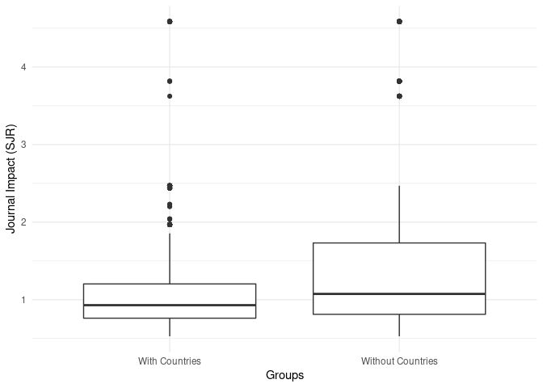
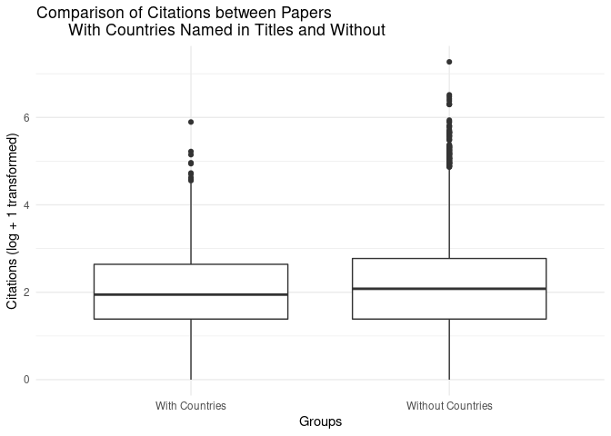
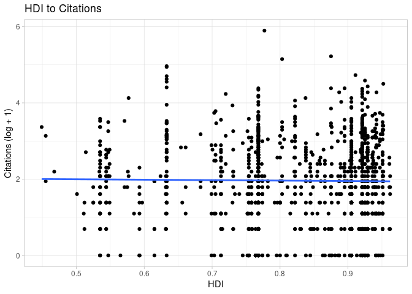
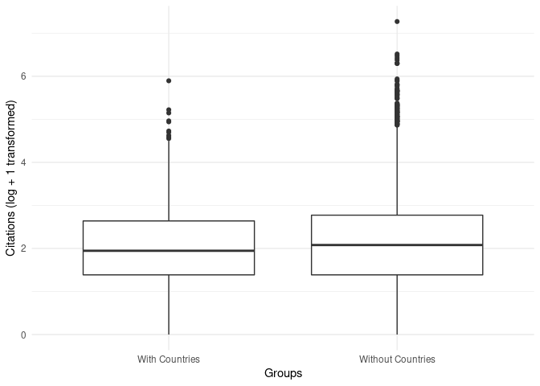
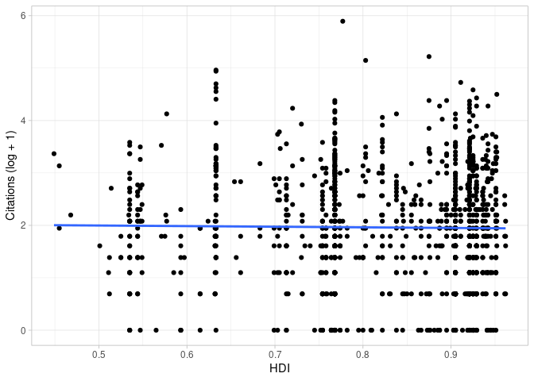
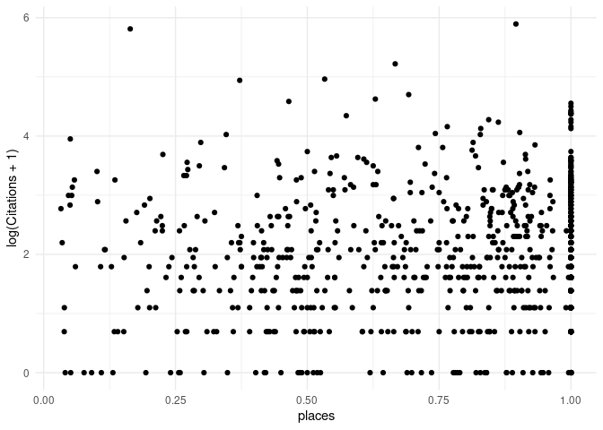
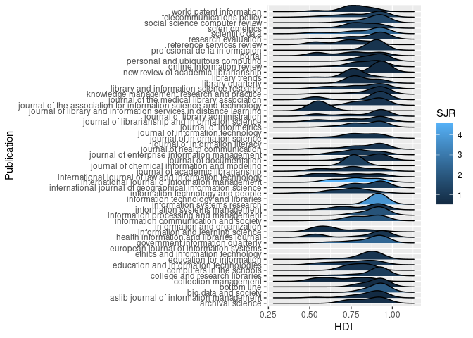

# Introduction

Writing a title for a paper is complicated and hard. Authors must write
a title that succinctly, yet informatively, captures the main topic of
their paper. Since titles function within the knowledge creation
process, titles reflect disciplinary identity and expectations
[@milojevic_length_2017]. In some disciplines, like math, titles focus
on succinctness. Yet in other areas, like the social sciences, titles
stress informativeness. This leads to various conventions, such as the
use of colons in titles. Titles with colons (compound titles) are less
succinct and potentially more informative. They move from making general
statements (left of colon) to specific statements (right of colon). The
specificity ranges from descriptive to declarative statements. Succinct
titles may focus on providing topical information only. Compound titles
add information about the method, research design, results, or
conclusion of a study [@li_evolution_2019].

Title informativeness can be helpful when searching literature for a
topic. The informativeness of a title can be a function of the words it
contains and its length or word count. Theoretically, the more unique
words in a title, the more likely a searcher might locate the work in an
online search. In the economics literature, longer titles receive more
citations ("the informative effect") than shorter, succinct titles ("the
succinct effect"), but this is only true after the year 2000.
@guo_succinct_2018 attributes this to the rise of online searching,
where retrieval technology is based on relevance algorithms that index
keywords in various bibliographic fields. \@li_evolution_2019 also found
that title length started to increase during this time frame, but
defined title informativeness not solely based on word count but on the
proportion of content words (e.g., nouns, verbs, adverbs) to function
words (e.g., pronouns, prepositions, conjunctions). Titles with a higher
ratio of content words are more informative. This may be complicated
though if those function words are overly specific, obscure, or
non-normative in some way [@fox_relationship_2015;
@thelwall_avoiding_2017].

If a title poorly captures the information about the content of a paper,
then papers may be overlooked by searchers even if the papers are
relevant to searchers. Alternatively, if title information is framed in
such a way as to seem non-applicable, even if the paper is relevant to a
searcher, then such papers may be overlooked. For example, papers with
titles that ask questions have been shown to receive more downloads than
papers with other title types but fewer citations [@jamali_article_2011],
or simply fewer citations [@paiva_articles_2012]. This suggests that the
information captured by a question-type title is not as informative, or
perhaps more trendy, than other title types and therefore results in a
relevance mismatch (i.e., it seemed relevant but was not) in online
searches or browsing. However, a disciplinary effect exists. Papers with
titles that ask questions are cited more in the computer science
literature [@fiala_are_2021] and no citation effects were found for
question-type titles in an ecology journal [@fox_relationship_2015]

As mentioned, the use of compound titles (titles with colons, hyphens,
dashes) has grown in recent decades, especially in some research areas
or disciplines. @li_evolution_2019 outlines three types of compound titles
that capture specific semantic content. These are titles that describe
the topic and the method or design, titles that describe the topic and
the results, and titles that describe the topic and the conclusion of a
study. In addition to these variations, some authors add geographical
names to compound titles, which may not add key semantic information
about a paper's topic [@kou_politics_2018]. A number of studies have shown
that papers with titles that contain certain types of highly specific or
obscure content, like genus or species information [@fox_relationship_2015], or
specific geographical place names, receive fewer citations
[@abramo_effect_2016; @costello_are_2019; @jacques_impact_2010; @moradi_analysis_2016; @paiva_articles_2012; @thelwall_avoiding_2017].
The common explanation is that this kind of taxonomic or geographic
specificity is extraneous to the study, and that it reduces the
generality and thus the appeal of the results reported in these papers
to searchers or potential audiences [@fox_relationship_2015;
@thelwall_avoiding_2017]. However, pointing to more disciplinary
differences, specificity might be appreciated in some disciplines, like
entomology, where titles with specific genus and species names or
geographic names have been shown to have greater impact [@murphy_does_2019].

@abramo_effect_2016 and others [@fox_relationship_2015; @thelwall_avoiding_2017]
have reasoned that overly specific terms or words in titles, especially
those naming geographic entities, tend to receive fewer citations
because searchers reviewing these titles do not find them relevant even
if the topic is relevant. @abramo_effect_2016 suggested, for papers with
geographical names in titles, that "studies conducted at the country
level would typically be less appealing that [sic] those dealing with
the same subjects at the broader level. The researcher [or potential
reader] could suspect that certain results would be influenced by
country-specific traits, and therefore be difficult to generalize" (p.
13). However, papers without specific geographical names in the titles
might still be limited to specific geographical areas, and this raises
questions not only about why some authors include geographical
information in titles, but also why some authors do not.

Only one study, that we could find, has shown different patterns in how
geographic names are used in titles among researchers around the world.
Based on a five year period of papers published in the CHI Conference
Proceedings, @kou_politics_2018 found differences in whether titles contain
geographic names depending on the population studied. They wrote that
"studies conducted with non-Western populations are significantly more
likely to highlight study contexts in titles and throughout the text,"
and that "studies of Western countries are significantly more likely to
lack mention of the studied countries not only in titles, but also
throughout the text of the papers" [@kou_politics_2018, p. 2]. They
reported that these findings held even after controlling for the
authors' countries. They also found that when country names were added
to titles, they were often added at the end of a title, which rarely
suggested "deep semantic connections between the preceding ideas in the
titles and the countries" (p. 8). Overall, their study suggests a
geographical bias in, at least the CHI literature, to normalize findings
based on Western populations and to exoticize findings based on
non-Western populations.

Like @kou_politics_2018, we are also interested how authors use geographic
names in titles. However, @kou_politics_2018 apply a simple binary
classification of countries into Western and non-Western countries based
on work by @huntington_clash_2011. However, like @burns_language_2017, we
use the Human Development Index (HDI)
[@united_nations_development_programme_human_2020] to identify patterns in
how countries are named in paper titles since we believe this should
offer a more nuanced view of the data. The UN classifies HDI scores into
four categories: very high (\>= 0.8), high (\>= 0.7), medium (\>= 0.55),
and low (\<= 0.549). Based on this, we ask HDI he following questions:

1.  Do articles with titles that name countries receive fewer citations
    than articles with titles without countries? Are there
    socioeconomical reasons that explain citation differences?
2.  Does naming countries in article titles add semantic value to the
    ideas expressed in the titles?

# Materials and Methods

Our data is focused on articles published in library and information
science (LIS) journals, as broadly categorized and listed by Scimago's
Scientific Journal Ranking (SJR) and the Scimago Journal and Country
Rank (2021) data. We limited our set of articles to the 61 journals
ranked in the first quartile of the LIS category. We then conducted
Scopus queries for each journal in this list and downloaded
bibliographic data for articles published in these journals from 2018 to
2020. Our data includes 13,145 article records across the 61 journals.
For example, our Scopus query for the journal *International Journal of
Information Management* was:

```         
SRCTITLE ( "International Journal of Information Management" )  AND  (
LIMIT-TO ( PUBYEAR ,  2020 )  OR  LIMIT-TO ( PUBYEAR ,  2019 )  OR  LIMIT-TO
( PUBYEAR ,  2018 ) )  AND  ( LIMIT-TO ( DOCTYPE ,  "ar" ) )
```

We combined and imported the bibliographic records into R using the
bibliometrix package. We used the *spaCy* natural language processing
Python library to extract country names from article titles. This
identified 1239 (9.4%) article titles with place names. We used the
2021-2022 Human Development Index (HDI) from the United Nations (UN)
Development Programme that matched the country in the titles. The HDI
summarizes three indices: a life expectancy index, an education index,
and GINI index for measuring income inequality.

Most places named in titles matched names in the HDI. However, some
articles had titles with country names that, for political reasons, do
not have an HDI, such as Taiwan and North Korea. These were marked as NA
in the HDI variable. This reduced titles with country names to 1236
records. If a place did not have an HDI but was part of a broader
collective, like Scotland or Puerto Rico, we chose the HDI for the
broader political authority (i.e., the United Kingdom or the United
States, respectively). The HDI also includes region level values. When
article titles referenced Africa, we used the HDI for "Sub-Saharan
Africa", and when article titles referenced Europe, we used the HDI for
"Europe and Central Asia". When multiple country names appeared in the
title (*n* = 86), we averaged the HDI scores for the named places. The
*spaCy* library was able to identify country names for constituent
locales, such as specific states in the U.S. Thus, if an article title
mentioned a place like 'Alaska', then 'United States' was used for the
country and HDI variables. Alternatively, if a title included a term
like *american*, the *spacy* library was able to reference this as the
*United States*. Therefore, titles may include a number of place name
variations. If so, we refer to the canonical name for the country that
is referenced or inferred in the title.

We were interested in the location of the country name in each article
title. The *spaCy* natural processing library detected the location of
866 country names in article titles. Country positions were scored on a
scale of 0 to 1.0, with countries appearing as the last word in a title
receiving a score of 1.0. In cases where multiple countries were named
in the title, the score was based on the first instance.

[Add spacy accuracy statement here.]

Finally, we added SCImago Journal Rank (SJR) scores for each of the 61
journal titles in the data set, We use the SJR to control for citation
effects across articles. SJR scores ranged from 0.528 to 4.585. A SJR
score below 1.0 indicates below average citations compared to all
journals in *Scopus*.

# Results

[Write intro to Results]


## Countries and Journal Impact


There were 202
unique country names or country name combinations
identified in the 1236 articles with
country names in titles and with HDI scores.
Out of these, 198
had HDI scores assigned to them.
China appeared in titles most frequently, followed by Spain, the U.S.A.,
the United Kingdom, and India.
The median HDI for the observed countries is
0.875,
which means most represented countries are classified as having
very high human development index scores
(*min* = 0.449,
*m* = 0.8221659
*max* = 0.962).
Table 1 lists the 20, 3 most frequently referenced place
names in titles along with their respective HDI scores.


Table: Table 1. Top 20 countries in article titles

|nation       |HDI   | Freq|
|:------------|:-----|----:|
|china        |0.768 |  175|
|spain        |0.905 |  146|
|usa          |0.921 |  112|
|uk           |0.929 |   52|
|india        |0.633 |   47|
|australia    |0.951 |   36|
|nigeria      |0.535 |   35|
|brazil       |0.754 |   30|
|south africa |0.713 |   25|
|italy        |0.895 |   22|
|korea        |0.925 |   22|
|russia       |0.822 |   21|
|canada       |0.936 |   19|
|pakistan     |0.544 |   16|
|mexico       |0.758 |   15|
|cuba         |0.764 |   14|
|turkiye      |0.838 |   13|
|japan        |0.925 |   13|
|germany      |0.942 |   12|
|ghana        |0.632 |   11|


Journals that receive SJR scores above 1.0 indicate journals that
receive above average citations compared to all journals in *Scopus*.
The average SJR for all the journals in our data was above the *Scopus*
average (*mdn* = 1.055)
The average SJR for journals that published
articles that did not include references to country names was also
higher (*mdn* = 1.074).
However, the average SJR journals that published
articles that did include references to countries was lower than the
*Scopus* average and lower than journals with articles without
references to countries (*mdn* = 0.929).
Overall, this suggests that
journals that tend to publish articles with titles containing references
to countries have less citation impact than journals that tend to
publish articles to do not reference countries.
Table 2 reports the journal titles that most frequently
publish articles that reference to country names.


Table: Table 2. Top 20 most frequent journal titles with countries mentioned in titles

|Publication                                               |SJR   | Freq|
|:---------------------------------------------------------|:-----|----:|
|scientometrics                                            |0.929 |  153|
|profesional de la informacion                             |0.831 |  133|
|education and information technologies                    |1.055 |   78|
|telecommunications policy                                 |1.203 |   68|
|journal of librarianship and information science          |0.756 |   66|
|information communication and society                     |1.968 |   65|
|scientific data                                           |2.468 |   63|
|government information quarterly                          |2.439 |   47|
|journal of academic librarianship                         |0.741 |   45|
|journal of health communication                           |0.88  |   45|
|international journal of information management           |4.584 |   38|
|online information review                                 |0.63  |   26|
|information and learning science                          |0.688 |   23|
|journal of enterprise information management              |0.968 |   22|
|international journal of geographical information science |1.144 |   21|
|information technology and people                         |1.074 |   19|
|aslib journal of information management                   |0.535 |   18|
|library trends                                            |0.536 |   18|
|health information and libraries journal                  |0.869 |   18|
|knowledge management research and practice                |0.541 |   17|


We compared the two groups using a a Wilcoxon rank-sum test.
The test revealed a significant difference them
(W = 6.3585605\times 10^{6},
p \< 0,
*n* with place names = 1236
*n* without place names = 11898).
However, even though articles without countries in titles
published in lower impact journals,
the overall effect size was small
(Cliff's delta = -0.1352385,
95% CI [-0.1677805, -0.102402]).




We suspected that journals with lower impact scores publish more
articles with place names in titles. Therefore we partitioned the list
of articles with places names in titles into three subsets: set1
contains articles in journals less than the median SJR for the set, set2
contains titles with greater than the median SJR, and set3 contains
papers in journals equal to SJR median.


Articles with country names in titles were less likely to appear in
journals with above median SJR scores
(*n* = 491;
*mdn* = 1.503)
compared to journals with below median SJR scores
(*n* = 592;
*mdn* = 1.503).
A portion of papers with countries named in titles were
published in journals with SJRs equal to the median
(*n* = 153;
*mdn* = 0.929).
A Wilcoxon ran-sum test was conducted to compare two below and
above median groups. The test revealed a significant difference
(W = 2.90672\times 10^{5};
*p* \< 0),
indicating that journals with higher SJR scores
publish fewer articles with country names in titles.







## Countries and Article Impact


We found that article titles with country names are more likely to have
lower citation counts than article titles without country names.
A Wilcoxon rank-sum test was conducted to compare the median citation counts. 
Articles with countries referenced in titles received fewer citations
(*mdn* = 6)
than articles without references to countries in titles
(*mdn* = 7).
The test revealed a significant difference between the two groups
(W = 6.8635535\times 10^{6},
*p* = 0,
*n* with place names = 1236,
*n* without place names = 11898).
These results suggest that papers without place names in titles received
more citations, in general, than papers with place names in titles.
However, the effect size was small.
We used Cliff's delta to assess the magnitude of the difference in
scores between papers with place names in titles to papers without place
names in titles.
The analysis revealed a negligible effect size in favor of papers
without place names in titles
(delta = -0.0665596,
95% CI [-0.0997288, -0.0332427]).




## Countries and HDIs


Countries with below median HDI scores
(*n* = 610)
were as likely to
appear in article titles as countries with higher HDI scores
(*n* = 613).
A linear regression analysis was conducted to examine the
relationship between HDI and citations for articles that reference
country names in titles.
The regression equation was not significant
(F-statistic: 0.221,
*p* = 0.639,
R-squared \< 0),
and the results indicated that the HDI
was not a significant predictor of citation counts
(t-value = -0.47,
*p* = 0.639,
*b* = -0.115).
We therefore found no significant effect on whether the
HDI of the named country in an article title had an effect on
the number of citations the article received.




Table: Table 3. Papers with countries named or referred to with highest citations

|nation       | Citations|   SJR|   HDI|
|:------------|---------:|-----:|-----:|
|india-usa    |       362| 4.584| 0.777|
|saudi arabia |       184| 4.584| 0.875|
|malaysia     |       171| 4.584| 0.803|
|india        |       142| 4.584| 0.633|
|india        |       139| 4.584| 0.633|
|uae          |       112| 1.055| 0.911|
|india        |       109| 4.584| 0.633|
|india        |       101| 2.439| 0.633|
|south korea  |        97| 4.584| 0.925|
|india        |        94| 4.584| 0.633|
|hong kong    |        89| 1.854| 0.952|
|uk           |        83| 1.203| 0.929|
|india        |        81| 4.584| 0.633|
|china        |        79| 4.584| 0.768|
|saudi arabia |        79| 4.584| 0.875|
|italy        |        79| 2.468| 0.895|
|usa          |        78| 4.584| 0.921|
|china        |        76| 2.468| 0.768|
|usa          |        73| 1.968| 0.921|
|uk           |        71| 4.584| 0.929|

## Country Naming and Semantic Value


We examined where the location of countries appeared in article titles
under the assumption that countries appearing near the end of a title
provided little informational value to the idea expressed in the first
part of the title.


On average, countries tended to be referenced near the end of a title
(*m* = 0.764,
*mdn* = 0.875),
suggesting that most articles that contain
names of countries in the data do so without adding much semantic
information to the title.
A Spearman's rank correlation was computed to compare the location of
the country name in a title and the citations received to the articles
with country names in titles. We found no relationship
(*r* = 0.062).





# Discussion

Papers naming or referring to countries in titles receive fewer
citations and are published in lower ranking journals than papers that
do not name or refer to countries in titles. Although Cliff's delta
reported negligible effect sizes for citation results, we think that a
cumulative effect might be in play. That is, if any particular author or
journal tends to publish papers with place names in titles, then the
citation scores for those authors or journals might receive fewer
citations depending on the frequency of papers with place names in
titles.

Limitations: it could be that the effects are more pronounced when
sampling from lower impact journals.

Results could be different with a longer citation window.

# Conclusion


# References
