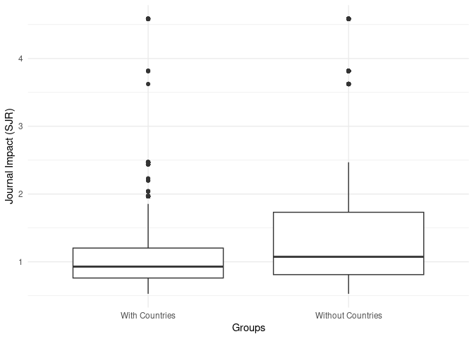
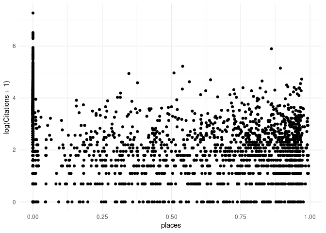
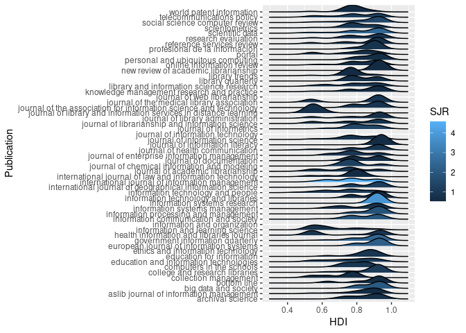

# Introduction

A good article title informs and can serve to attract readers. Authors
must write titles that succinctly capture the main topic of their paper.
Since titles function within the knowledge creation process, titles
reflect disciplinary identity and expectations [@milojevic_length_2017].
In some disciplines, like math, titles focus on succinctness. Yet in
other areas, like the social sciences, titles stress informativeness. In
the medical sciences, the use of questions in titles has increased
substantially since the 1960s, showing also geographical trends,
representing perhaps institutional pressures to publish faster
[@ball2009].

The need to market papers, express disciplinary identity, provide
information, and other factors leads to various naming conventions, such
as the use of colons in titles. Titles with colons (compound titles) are
less succinct and potentially more informative. They move from making
general statements (left of colon) to specific statements (right of
colon). The specificity ranges from descriptive to declarative
statements. Succinct titles may focus on providing topical information.
Compound titles may add information about the method, research design,
results, or conclusion of a study [@li_evolution_2019].

Title informativeness can be helpful when searching literature for a
topic. The informativeness of a title can be a function of the words it
contains and its length or word count. In the economics literature,
longer titles receive more citations ("the informative effect") than
shorter, succinct titles ("the succinct effect"), but this is only true
after the year 2000. @guo_succinct_2018 attributes this to the rise of
online searching, where retrieval technology is based on relevance
algorithms that index keywords in various bibliographic fields.
@li_evolution_2019 found that title length started to increase during
this time frame, but defined title informativeness not solely based on
word count but on the proportion of content words (e.g., nouns, verbs,
adverbs) to function words (e.g., pronouns, prepositions, conjunctions).
Titles with a higher ratio of content words are more informative. This
may be complicated though if those function words are overly specific,
obscure, or non-normative in some way [@fox_relationship_2015;
@thelwall_avoiding_2017].

If a title poorly captures the information about the content of a paper,
then papers may be overlooked by searchers even if the papers are
relevant to them. Alternatively, if title information is framed in such
a way as to seem non-applicable, even if the paper is relevant to a
searcher, then such papers may be overlooked. For example, papers with
titles that ask questions have been shown to receive more downloads but
fewer citations than papers with other title types
[@jamali_article_2011; @paiva_articles_2012]. This suggests that the
information captured by a question-type title is informative but trendy,
not as informative, or that the authors are less certain of the
findings. However, a disciplinary effect exists. Papers with titles that
ask questions are cited more in the computer science literature
[@fiala_are_2021] and no citation effects were found for question-type
titles in an ecology journal [@fox_relationship_2015]

As mentioned, the use of compound titles (titles with colons, hyphens,
dashes) has grown in recent decades, especially in some research areas
or disciplines. @li_evolution_2019 outlines three types of compound
titles that capture specific semantic content. These are titles that
describe the topic and the method or design, titles that describe the
topic and the results, and titles that describe the topic and the
conclusion of a study. In addition to these variations, some authors add
geographical names to compound titles, which may not add key semantic
information about a paper's topic [@kou_politics_2018]. A number of
studies have shown that papers with titles that contain certain types of
highly specific or obscure content, like genus or species information
[@fox_relationship_2015], or specific geographical place names, receive
fewer citations [@abramo_effect_2016; @costello_are_2019;
@jacques_impact_2010; @moradi_analysis_2016; @paiva_articles_2012;
@thelwall_avoiding_2017]. The common explanation is that this kind of
taxonomic or geographic specificity is extraneous to the study, and that
it reduces the generality and thus the appeal of the results reported in
these papers to searchers or potential audiences
[@fox_relationship_2015; @thelwall_avoiding_2017]. However, pointing to
more disciplinary differences, specificity might be appreciated in some
disciplines, like entomology, where titles with specific genus and
species names or geographic names have been shown to have greater impact
[@murphy_does_2019].

@abramo_effect_2016 and others [@fox_relationship_2015;
@thelwall_avoiding_2017] have reasoned that overly specific terms or
words in titles, especially those naming geographic entities, tend to
receive fewer citations because searchers reviewing these titles do not
find them relevant even if the topic is relevant. @abramo_effect_2016
suggested, for papers with geographical names in titles, that "studies
conducted at the country level would typically be less appealing that
[sic] those dealing with the same subjects at the broader level. The
researcher [or potential reader] could suspect that certain results
would be influenced by country-specific traits, and therefore be
difficult to generalize" (p. 13). However, papers without specific
geographical names in the titles might still be limited to specific
geographical areas, and this raises questions not only about why some
authors include geographical information in titles but also why some
authors do not.

Only one study, that we could find, has shown different patterns in how
geographic names are used in titles among researchers around the world.
Based on a five year period of papers published in the CHI Conference
Proceedings, @kou_politics_2018 found differences in whether titles
contain geographic names depending on the population studied. They wrote
that "studies conducted with non-Western populations are significantly
more likely to highlight study contexts in titles and throughout the
text," and that "studies of Western countries are significantly more
likely to lack mention of the studied countries not only in titles, but
also throughout the text of the papers" [@kou_politics_2018, p. 2]. They
reported that these findings held even after controlling for the
authors' countries. They also found that when country names were added
to titles, they were often added at the end of a title, which rarely
suggested "deep semantic connections between the preceding ideas in the
titles and the countries" (p. 8). Overall, their study suggests a
geographical bias in, at least the CHI literature, to normalize findings
based on Western populations and to exoticize findings based on
non-Western populations.

Like @kou_politics_2018, we are also interested how authors use
geographic names in titles. However, @kou_politics_2018 apply a simple
binary classification of countries into Western and non-Western
countries based on work by @huntington_clash_2011. However, like
@burns_language_2017, we use the Human Development Index (HDI)
[@united_nations_human_2023], an index that measures a nation's level of
health, education, and standard of living, to identify patterns in how
countries are named in paper titles. We believe this offer a more
nuanced view of the data. Based on this, we ask the following questions:

## Research Questions

Research Question: Does the inclusion of geographical names in the titles
of journal articles impact their citation counts,
when controlling for journal impact factor and Human Development Index?

Sub questions:

* Is there a correlation between the position of the geographical name in the article title and the number of citations?
* Does the Human Development Index of the nation mentioned in the title correlate with the number of citations?

Hypotheses:

* Main Hypothesis: Journal articles with geographical names in their titles are cited less frequently than those without geographical names.
  * Sub-Hypothesis 1: The closer the geographical name is to the beginning of the title, the fewer the citations.
  * Sub-Hypothesis 2: Articles mentioning nations with a higher Human Development Index in their titles are cited more frequently.
  * Sub-Hypothesis 3: The impact of geographical names in titles on citation counts is moderated by the impact factor of the journal.

# Materials and Methods


Our data is focused on articles published in library and information
science (LIS) journals, as broadly categorized and listed by Scimago's
Scientific Journal Ranking (SJR) and the Scimago Journal and Country
Rank (2021) data. We limited our set of articles to the 61 journals
ranked in the first quartile of the LIS category. We conducted Scopus
queries for each journal in this list and downloaded bibliographic data
for articles published in these journals from 2018 to 2020. We retrieved
13145 article records across the 61 journals. For example, our
Scopus query for the journal *International Journal of Information
Management* was:

```         
SRCTITLE ( "International Journal of Information Management" )  AND  (
LIMIT-TO ( PUBYEAR ,  2020 )  OR  LIMIT-TO ( PUBYEAR ,  2019 )  OR  LIMIT-TO
( PUBYEAR ,  2018 ) )  AND  ( LIMIT-TO ( DOCTYPE ,  "ar" ) )
```

We combined and imported the bibliographic records into R using the
bibliometrix package [@aria_bibliometrix_2017]. We used the *spaCy*
[@honnibal_spacy_2022] natural language processing Python library to
identify country names from article titles. We manually reviewed and
revised the data after locating false positives or negatives. This resulted in 
1493 (11.36%) article titles with place names. We
used the 2021-2022 Human Development Index (HDI) from the United Nations
(UN) Development Programme that matched the country in the titles. The
HDI summarizes three indices: a life expectancy index, an education
index, and GINI index for measuring income inequality.


The Python *spaCy* library was able to identify country names for
constituent locales, such as specific states in the U.S. Thus, if an
article title mentioned a place like "Alaska", then "United States" was
used for the nation and HDI variables. Alternatively, if a title
included a term like "american", the *spacy* library was able to
reference this as the *United States*. Therefore, titles may include a
number of place name variations. If so, we refer to the canonical name
for the nation that is referenced or inferred in the title.

We were interested in the location of the place name in each article title.
We wrote a Python script,
calling the *spaCy* natural processing library,
which detected the location of the nation names in article titles.
Manual editing was needed to address false
positives and negatives.
The position of places in article titles was scored on a
scale of 0 to 1.0, with nations appearing as the last word in a title
receiving a score approaching 1.0. Titles that did not contain a reference to
a geographical region scored a zero.
In cases where multiple countries were named
in the title, the score was based on the first instance.

Most places named in titles matched names in the HDI. However, some
articles had titles with nation names that for political reasons do not
have an HDI (e.g., Taiwan and North Korea). These were marked as NA in
the HDI variable. This reduced titles with nation names and HDI scores
to 1484 records. If a place was
part of a broader collective (e.g., Scotland or Puerto Rico), we chose
the HDI for the broader political authority (i.e., the United Kingdom or
the United States, respectively). The HDI includes region level values:
when article titles referenced Africa, we used the HDI for "Sub-Saharan
Africa", and when article titles referenced Europe, we used the HDI for
"Europe and Central Asia" (*n* = 154).
When multiple place names appeared in the
title (*n* = 94), we averaged the HDI scores for the
named or inferred nations.
The UN classifies HDI scores into four
categories: very high (\>= 0.8), high (\>= 0.7), medium (\>= 0.55), and
low (\<= 0.549).
The averaged HDI for titles that mention multiple locations
was very high on the HDI scale (*m* = 0.858; *mdn* = 0.867),
indicating that nations with very high HDIs collaborate with nations
who also have very high HDIs.
However, the overall average HDI scores indicate that most nations or places
named in article titles are nations or places with very high HDI scores
(*m* = 0.814; *mdn* = 0.838).

Finally, we added SCImago Journal Rank (SJR) scores for each of the 61
journal titles in the data set. We use the SJR to control for citation
effects across articles. SJR scores ranged from 0.528 to
4.584. A SJR
score below 1.0 indicates below average citations compared to all
journals in *Scopus*. The average SJR in the data was above average
(*m* = 1.333; *mdn* = 1.055).
However, after deduplicating publication titles,
the average SJR in the data was lower
(*m* = 1.155; *mdn* = 0.848),
indicating that article titles, that reference places, appear more often
in journals with higher SJRs.

# Results

[Write intro to Results]


## Hypotheses

Main Hypothesis: Journal articles with geographical names in their titles are cited less frequently than those without geographical names.


> The Mann-Whitney U test suggests that articles with nation names in their titles have a different citation distribution compared to those without nation names. The p-value is highly significant, supporting the hypothesis that including a geographical name affects citation counts.
> The Mann-Whitney U test indicates that the presence of a nation's name in the title does have a statistically significant impact on citation counts, although it doesn't tell us the direction of this impact (i.e., whether it's positive or negative).

The average citations for articles containing a place name are less
(*mdn*=6) than
articles that do not contain a place name
(*mdn*=7).

Sub-Hypothesis 1: The closer the geographical name is to the beginning of the title, the fewer the citations.


> The Spearman's rank correlation test on the subset of articles with nation names showed a weak but statistically significant positive correlation between the position of the nation name in the title and the number of citations. The rho value was 0.094, and the p-value was significant.
> The Spearman's test suggests that within the subset of articles that do have a nation's name in the title, the position of that name has a weak but statistically significant positive correlation with citation counts.

Sub-Hypothesis 2: Articles mentioning nations with a higher Human Development Index in their titles are cited more frequently.


> Statistical Significance: The high p-value suggests that any observed correlation between HDI and citation counts is likely due to random chance.
> Effect Size: The rho value near zero indicates that there is no meaningful relationship between the HDI of the nation mentioned in the title and the number of citations the article receives.

Sub-Hypothesis 3: The impact of geographical names in titles on citation counts is moderated by the impact factor of the journal.


> Statistical Significance: The p-value suggests that the observed differences in rank-transformed citation counts across different levels of the interaction term (places * impact factor) are likely due to random chance.
> Practical Implications: Given the non-significant result, it seems that the impact factor of the journal does not play a moderating role in the relationship between geographical names in article titles and citation counts, at least based on the data you have.

Sub-Hypothesis 4: Journals with a high frequency of articles with geographical names in titles have lower impact factors.


> Statistical Significance: The p-value suggests that the observed correlation is not statistically significant, meaning it could be due to random chance.
> Effect Size: The rho value indicates a weak negative correlation, suggesting that journals that more frequently publish articles with place names might have slightly lower impact factors, although this is not statistically confirmed.

Sub-Hypothesis 5: Are there any trends with where certain nations appear in the titles?


> Statistical Significance: The p-value suggests that the observed correlation could be due to random chance, as it's not statistically significant at the 0.05 level.
> Effect Size: The rho value indicates a weak negative correlation, hinting at a trend where nations that appear more frequently in titles may have their names positioned closer to the beginning of the title.

Sub-Hypothesis 6: Journals may be more or less likely to publish articles that mention nations with higher or lower HDIs.


> Statistical Significance: The p-value suggests that the observed correlation is not statistically significant, meaning it could be due to random chance.
> Effect Size: The rho value indicates a weak negative correlation, suggesting that journals that more frequently publish articles mentioning nations might tend to mention nations with slightly lower HDIs, although this is not statistically confirmed.

## Countries and Journal Impact


There were 190 country names or country name combinations
identified in the 1484 articles with country
names in titles.
Out of these, 187 had HDI scores assigned to them.
China appeared in titles most frequently, followed by Spain, the U.S.A.,
the European Union, the United Kingdom, and India.
The median HDI for the observed countries is
0.838.
Therefore, most identified countries are
classified as having very high human development index scores
(*min* = 0.428,
*m* = 0.814,
*max* = 0.962).
Table 1 lists the 20 most
frequently referenced country names in titles along with their
respective HDI scores.


Table: Table 1. Top 20 countries in article titles

|nation        |HDI   | Freq|
|:-------------|:-----|----:|
|china         |0.768 |  183|
|spain         |0.905 |  157|
|us            |0.921 |  139|
|eu            |0.796 |   86|
|uk            |0.929 |   65|
|india         |0.633 |   49|
|nigeria       |0.535 |   40|
|africa        |0.547 |   38|
|australia     |0.951 |   37|
|brazil        |0.754 |   33|
|south africa  |0.713 |   26|
|russia        |0.822 |   23|
|italy         |0.895 |   23|
|canada        |0.936 |   23|
|korea         |0.925 |   20|
|pakistan      |0.544 |   17|
|latin america |0.754 |   16|
|germany       |0.942 |   16|
|mexico        |0.758 |   15|
|cuba          |0.764 |   14|

### Journals with Articles with Country Names in Titles Receiver Fewer Citations

Journals that receive SJR scores above 1.0 indicate journals that
receive above average citations compared to all journals in *Scopus*.
The average SJR for all the journals in our data was slightly above the
*Scopus* average (*mdn* = 1.055). We sought to test
whether country names in article titles had an impact on journal
citations. We divided the data into two groups: articles with country
names referenced in titles and articles without country names referenced
in titles. We compared the SJR of the journals between these two groups.
Even though there are journal titles that belong to both groups, our
goal was to observe the effect that country names have on overall
journal citations.

We found that the inclusion of country names in article titles had a
negative effect on citations to journals. The average SJR for journals
that published articles that did not include references to country names
was higher (*mdn* = 1.074) than the SJR
average. However, the average SJR for journals that published articles
that did include references to countries was lower than the *Scopus*
average and lower than journals with articles without references to
countries (*mdn* = 0.929). Overall, this suggests
that journals that tend to publish articles with titles containing
references to countries receive fewer citations than journals that tend
to publish articles to do not reference countries. Table 2 reports the
journal titles that most frequently publish articles that reference
country names in article titles.


Table: Table 2. Top 20 most frequent journal titles with countries mentioned in titles

|Publication                                               |SJR   | Freq|
|:---------------------------------------------------------|:-----|----:|
|scientometrics                                            |0.929 |  187|
|profesional de la informacion                             |0.831 |  164|
|telecommunications policy                                 |1.203 |  101|
|education and information technologies                    |1.055 |   84|
|scientific data                                           |2.468 |   76|
|information communication and society                     |1.968 |   74|
|journal of librarianship and information science          |0.756 |   70|
|journal of health communication                           |0.88  |   51|
|government information quarterly                          |2.439 |   50|
|journal of academic librarianship                         |0.741 |   49|
|international journal of information management           |4.584 |   42|
|online information review                                 |0.63  |   30|
|international journal of geographical information science |1.144 |   28|
|health information and libraries journal                  |0.869 |   27|
|information and learning science                          |0.688 |   25|
|research evaluation                                       |0.779 |   23|
|journal of enterprise information management              |0.968 |   23|
|information technology and people                         |1.074 |   23|
|library trends                                            |0.536 |   22|
|knowledge management research and practice                |0.541 |   21|


We compared the average SJR of journals with articles with country names
in titles to the SJR of journals without country names in articles using
a Wilcoxon rank-sum test. The test revealed a significant difference (W
= 7.360365\times 10^{6}, p \< 0, *n*
with place names = 1484 *n* without place names =
11652). However, even though articles without
countries in titles published in lower impact journals, the overall
effect size was small (Cliff's delta = -0.1486758, 95% CI
[-0.1785683, -0.1185091]).




### Lower impact journals publish more articles with country names in titles

We suspected that journals with lower impact scores publish more
articles with place names in titles. Therefore we partitioned the list
of articles with places names in titles into three subsets: set1
contains articles in journals with less than the median SJR, set2
contains articles in journals with greater than the median SJR, and set3
contains articles in journals equal to SJR median.


Although some articles with countries named in titles were published in
journals with SJRs equal to the median (*n* =
187; *mdn* =
0.929), we found that articles with country
names in titles were less likely to appear in journals with above median
SJR scores (*n* = 584; *mdn* =
1.437) and more likley to appear in
journals with below median SJR scores (*n* =
713; *mdn* =
0.756).

We applied a Wilcoxon ran-sum test to compare the below and above median
groups. The test revealed a significant difference (W =
4.16392\times 10^{5}; *p* \< 0), indicating
that journals with higher SJR scores publish fewer articles with country
names in titles.


## Countries and Article Impact


We found that article titles with country names are more likely to have
lower citation counts than article titles without country names. A
Wilcoxon rank-sum test was conducted to compare the median citation
counts. Articles with countries referenced in titles received fewer
citations (*mdn* = 6) than articles
without references to countries in titles (*mdn* =
7). The test revealed a significant
difference between the two groups (W = 7.9857985\times 10^{6}, *p* =
0, *n* with place names =
1484, *n* without place names =
11652). These results suggest that
papers without place names in titles received more citations, in
general, than papers with place names in titles. However, the effect
size was small. We used Cliff's delta to assess the magnitude of the
difference in scores between papers with place names in titles to papers
without place names in titles. The analysis revealed a negligible effect
size in favor of papers without place names in titles (delta =
-0.0763361, 95% CI [-0.1069293, -0.0455985]).


## Countries and HDIs


Countries with below median HDI scores (*n* = 738) were as
likely to appear in article titles as countries with higher HDI scores
(*n* = 731). A linear regression analysis was conducted to
examine the relationship between HDI and citations for articles that
reference country names in titles. The regression equation was not
significant (F-statistic: 0.594, *p* =
0.441, R-squared \<
0), and the results indicated that the
HDI was not a significant predictor of citation counts (t-value =
-0.771, *p* =
0.441, *b* =
-0.17). We therefore found no
significant effect on whether the HDI of the named country in an article
title had an effect on the number of citations the article received.


Table: Table 3. Papers with countries named or referred to with highest citations

|nation               | Citations|   SJR|   HDI|
|:--------------------|---------:|-----:|-----:|
|india                |       362| 4.584| 0.777|
|saudi arabia         |       184| 4.584| 0.875|
|malaysia             |       171| 4.584| 0.803|
|india                |       142| 4.584| 0.633|
|india                |       139| 4.584| 0.633|
|united arab emirates |       112| 1.055| 0.911|
|india                |       109| 4.584| 0.633|
|eu                   |       104| 0.929| 0.796|
|india                |       101| 2.439| 0.633|
|south korea          |        97| 4.584| 0.925|
|india                |        94| 4.584| 0.633|
|hong kong            |        89| 1.854| 0.952|
|uk                   |        83| 1.203| 0.929|
|india                |        81| 4.584| 0.633|
|africa               |        80| 1.203| 0.547|
|china                |        79| 4.584| 0.768|
|saudi arabia         |        79| 4.584| 0.875|
|italy                |        79| 2.468| 0.895|
|us                   |        78| 4.584| 0.921|
|china                |        76| 2.468| 0.768|

## Country Naming and Semantic Value

We examined where the location of countries appeared in article titles
under the assumption that countries appearing near the end of a title
provided little informational value to the idea expressed in the first
part of the title.


On average, countries tended to be referenced near the end of a title
(*m* = 0.076, *mdn* =
0), suggesting that most articles
that contain names of countries in the data do so without adding much
semantic information to the title. A Spearman's rank correlation was
computed to compare the location of the country name in a title and the
citations received to the articles with country names in titles. We
found no relationship (*r* = -0.04).





# Discussion

This study brought for us a wide set of findings which addressed the
research questions that we set for the study. Initially, the present
study has examined whether the presence of a country name in the title
reduce the chances of getting more citations. These findings are
discussed. Papers naming or referring to countries in titles receive
fewer citations and are published in lower ranking journals than papers
that do not name or refer to countries in titles. In a broad sense, the
scientific publications containing with a country name receive lower
impact values e.g., the impact factor (IF) of the publishing journrals.
However, under the different subject categories the result can be
different [@abramo_effect_2016]. Although Cliff's delta reported
negligible effect sizes for citation results, we think that a cumulative
effect might be in play. That is, if any particular author or journal
tends to publish papers with place names in titles, then the citation
scores for those authors or journals might receive fewer citations
depending on the frequency of papers with place names in titles. This
result provides general confirmation of our study. This might be reason
that putting the country name in the title limits the generality of the
research findings, and country-level title is less appealing to the
global researchers. While it is read less, this leads to get fewer
citations.

However, under the countries and HDIs, this can be different in the
context of non-western countries as well. For example, a researcher from
a researcher from developing countries has the intuition to read the
USA-based authors' papers to know the context and understand the
research in his or her similar research areas. This helps and increases
the chances of the developing country researchers to read some good
quality papers. So, country name in the title and if it is written by
western authors might get the citations by the developing country
researchers. Country names adding at the end of the title e.g. right
part of the title do not add much semantic information. For example,
'Information seeking behaviours of the graduate students: A study on the
students from Bangladesh' where the subtitle does not add much
information or value to the article if researchers prepare the title
with the left part of the article. However, this might be different with
some disciplines and articles where the lengthy titles and occurrences
of words in the title matters. However, these practices are not fixed
and have changed over times. While the title is an important factor to
the researchers, there need to be a balance between informativeness and
attractiveness.

Although papers that reference country names in titles received fewer
citations and journals that frequently include articles that refer to
named countries had lower SJR scores, we could find no relationship
between the development level of a named country with the number of
citations. We could also find no relationship between the location of
the country name in the title with the article's citations. Overall,
although articles that reference country names in their titles receive
fewer citations and journals have lower SJR scores, there does not seem
to be a geographical bias against specific countries. We believe that
the citation disadvantage associated with lower citation counts to
articles that reference named countries is primarily a result of perhaps
unnecessary specificity that naming countries adds to the titles and
that makes the articles seem less relevant to others. While the country
name in the article's title refer to less citation and placed in the
lower ranked journals, we recommend not to use country name in the
title. Even having a country name in the title may lead to bias among
the researchers.

Limitations: It could be that the effects are more pronounced when
sampling from lower impact journals in some other disciplines. Here, we
only considered the LIS journals. A future study with the journals from
other disciplines can vetted the present result that we got from this
study. Even, the results could be different with a longer citation
window. We also did not control for other factors, such if a title
contains a colon, a question, humor.

# Conclusion

# References
