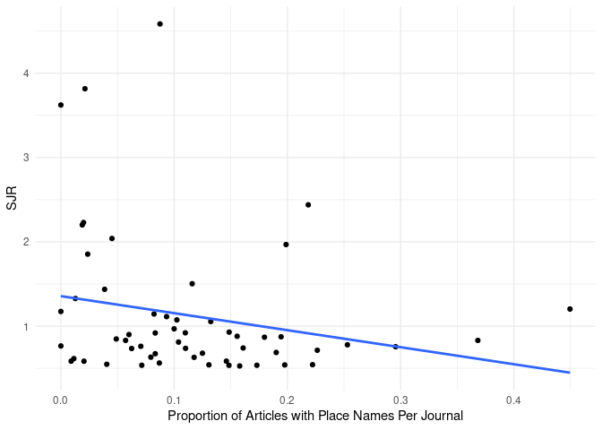

# Abstract

This investigation explores
the impact of geographical names
within article titles
on citation frequency
across a corpus of literature
within the field of
library and information science,
spanning from 2018 to 2020,
and encompassing sixty-one journal titles.
We hypothesized that
the presence of geographical names
of nations
in article titles
would negatively correlate
with citation frequency.
Our primary analysis of
1484 articles with
geographical names versus 11652 without,
revealed a statistically significant,
albeit small,
difference in median citations,
favoring articles without geographical names (*mdn* = 7)
over those with geographical names (*mdn* = 6).
Contrary to our secondary hypothesis,
a proximity analysis demonstrated a weak,
positive correlation between
the closeness of geographical names
to the title end and citation counts.
Additionally, our examination found
no evidence supporting differential
citation frequency based
on the Human Development Index (HDI)
of the nations mentioned in titles,
nor did the impact factor of the
journal moderate the
relationship between
geographical names and citation frequency.
A weak, negative correlation was
discovered between the frequency of
geographical names in journal titles
and the journals' impact scores,
yet this was not statistically significant.
Our data also suggested a vague positional
preference for nations within titles,
unrelated to HDI.
Furthermore, the likelihood of
journals publishing articles
mentioning nations of varying HDI
was found to be statistically insignificant.
This study sheds light
on the nuanced influence of title specificity,
through geographical names,
on scholarly communication and citation impact,
indicating a slight preference
for broader title phrasing in garnering citations.

Keywords: Human Development Index, scholarly communication,
scholarly writing, nation names, library and information science

# Introduction

A well-crafted article title informs and
can serve to attract readers.
Authors must write titles that succinctly
capture the central theme of their paper.
Since titles function within the knowledge creation process,
titles reflect disciplinary identity and expectations
[@milojevic_length_2017].
In some disciplines,
like math,
titles focus on succinctness.
Yet in other areas,
like the social sciences,
titles stress informativeness.
In the medical sciences,
the use of questions in titles has increased substantially since the 1960s,
showing also geographical trends,
representing perhaps institutional pressures to publish faster
[@ball2009].

The necessity to promote academic papers,
to express disciplinary identity,
to provide information,
and other factors leads to various naming conventions,
such as
using colons in titles,
writing succinct titles, or
writing compound titles.
Naming conventions can be informative.
Titles with colons (compound titles) are
less succinct and potentially more informative.
They move from making general statements (left of colon)
to specific statements (right of colon).
The specificity ranges from descriptive to declarative statements.
Succinct titles may focus on providing topical information.
Compound titles may add information about the method,
research design, results, or conclusion of a study
[@li_evolution_2019].

Title informativeness can be helpful
when searching literature for a topic.
The informativeness of a title can
be a function of the words
it contains and its length or word count.
In the economics literature,
longer titles receive more citations ("the informative effect")
than succinct titles ("the succinct effect"),
but this is only true after the year 2000.
@guo_succinct_2018 attributes this
to the rise of online searching,
where retrieval technology
based on relevance algorithms
begins to replace searching by
keyword in various bibliographic fields.
@li_evolution_2019 found that title length
started to increase during this time frame,
but defined title informativeness not solely based on word count
but on the proportion of content words
(e.g., nouns, verbs, adverbs) to function words
(e.g., pronouns, prepositions, conjunctions).
Titles with a higher ratio of
content words are more informative.
This may be complicated though
if function words are overly specific,
obscure, or non-normative in some way
[@fox_relationship_2015; @thelwall_avoiding_2017].

If a title poorly captures the
information about the content of a paper,
then papers may be overlooked by searchers
even if the papers are relevant to them.
Alternatively, if title information appears non-applicable,
even if the paper is relevant to a searcher,
then such papers may be overlooked.
For example, papers with titles that ask questions
have been shown to receive
more downloads but fewer citations
than papers with other title types
[@jamali_article_2011; @paiva_articles_2012].
This suggests that the informativeness of
a question-type title is not substantial.
However, disciplinary effects exist.
Papers with titles that ask questions are cited more
in the computer science literature [@fiala_are_2021],
but no citation effects were found for question-type
titles in an ecology journal [@fox_relationship_2015].

As mentioned, the use of compound titles
(titles with colons, hyphens, dashes) has grown in recent decades,
especially in some research areas or disciplines.
@li_evolution_2019 outline three types of compound titles
that capture specific semantic content.
These are titles that describe the topic and the method or design,
titles that describe the topic and the results, and
titles that describe the topic and the conclusion of a study.
Additionally, some authors add geographical names to compound titles,
which may not add key semantic information
about a paper's topic [@kou_politics_2018].
Studies have shown that papers with titles
that contain certain types of highly specific or obscure content,
like genus or species information [@fox_relationship_2015],
or specific geographical place names,
receive fewer citations
[@abramo_effect_2016; @costello_are_2019; @jacques_impact_2010;
@moradi_analysis_2016; @paiva_articles_2012; @thelwall_avoiding_2017].
The common explanation is that this kind of taxonomic or geographic specificity
is extraneous to the study, and
that it reduces the generality and
the appeal of the results
[@fox_relationship_2015; @thelwall_avoiding_2017].
However, pointing to more disciplinary differences,
specificity might be appreciated in some disciplines,
like entomology,
where titles with specific genus and species names or geographic names
have been shown to have greater impact [@murphy_does_2019].

@abramo_effect_2016 and others
[@fox_relationship_2015; @thelwall_avoiding_2017]
have reasoned that overly specific terms or words in titles,
especially those naming geographic entities,
tend to receive fewer citations
because searchers reviewing these titles do not
find them relevant even if the topic is relevant.
@abramo_effect_2016 suggested,
for papers with geographical names in titles, that
"studies conducted at the country level would typically be less appealing
that [sic] those dealing with the same subjects at the broader level.
The researcher [or potential reader] could suspect that certain results
would be influenced by country-specific traits,
and therefore be difficult to generalize" (p. 13).
However, papers without specific geographical names in the titles
might still be limited to specific geographical areas,
and this raises questions about why authors
decide to include geographical information in titles.

There is compelling evidence that
the use of geographic names
in article titles
reveals potential biases
in the representation of Western and non-Western
populations in the CHI Conference Proceedings.
Specifically, @kou_politics_2018 found that
"studies conducted with non-Western populations are significantly
more likely to highlight study contexts in titles and throughout the text,"
and that
"studies of Western countries are significantly more likely
to lack mention of the studied countries not only in titles,
but also throughout the text of the papers" [@kou_politics_2018, p. 2].
Their findings revealed that
when country names were added to titles,
they were often added at the end of a title.
To them this suggested weak
"semantic connections between the preceding ideas in the titles and the countries" (p. 8).
Overall, their study suggests a geographical bias in the CHI literature
to normalize findings based on Western populations and
to make exotic those findings based on non-Western populations.

Like @kou_politics_2018,
our interest lies in
examining the context in
how authors use geographic names in titles.
However, @kou_politics_2018 apply a simple binary classification
of countries into Western and non-Western countries
based on work by @huntington_clash_2011.
@burns_language_2017 use the
Human Development Index (HDI)
[@united_nations_human_2023],
a compound index that measures a nation's level of
health, education, and standard of living,
in order to identify more nuanced patterns,
to identify language and geographical bias
in the peer review process.
We follow @burns_language_2017 in using
the HDI to ask the following questions
for the current study:

RQ: Does the inclusion of geographical names in the titles
of journal articles impact their citation counts,
after accounting for the Human Development Index
score for the named location?

In order to answer these questions,
we propose the following hypotheses:

* Main Hypothesis: Journal articles with geographical names in their titles are
  cited less frequently than those without geographical names.
    * Sub-Hypothesis 1: The closer a geographical name is to the end of the title, the fewer the citations the article would receive.
    * Sub-Hypothesis 2: Articles that mention nations with a higher Human Development Index in their titles are cited more frequently than articles that mention names with a lower Human Development Index.
    * Sub-Hypothesis 3: The impact of geographical names in titles on citation counts is moderated by the impact of the journal.
    * Sub-Hypothesis 4: Journals with a high frequency of articles with geographical names in titles have a lower impact compared to journals with a low frequency of articles with geographic names in article titles.
    * Sub-Hypothesis 5: Nations with lower HDIs will more likely appear toward the end of article titles than nations with higher HDIs.
    * Sub-Hypothesis 6: Journals may be more or less likely to publish articles that mention nations with higher or lower HDIs.

# Materials and Methods


Our data is focused on articles published in
library and information science (LIS) journals,
as broadly categorized and listed by
Scimago's Scientific Journal Ranking (SJR) and
the Scimago Journal and Country Rank (2021) data.
We limited our set of articles to journals
ranked in the first quartile (Q1) of the LIS category.
We conducted Scopus queries for each journal in this list
and downloaded bibliographic records for articles published
in these journals from 2018 to 2020 (Fig. 1).
We limited our data to the three year time period
in order to align with the Scimago journal ranking time frame.
We retrieved 10032 article records
across the 56 journals.
For example, our Scopus query for the journal
*International Journal of Information Management* was:

```
SRCTITLE ( "International Journal of Information Management" )  AND  (
LIMIT-TO ( PUBYEAR ,  2020 )  OR  LIMIT-TO ( PUBYEAR ,  2019 )  OR  LIMIT-TO
( PUBYEAR ,  2018 ) )  AND  ( LIMIT-TO ( DOCTYPE ,  "ar" ) )
```
<figcaption>*Fig. 1: Example Scopus query to retrieve bibliographic records from one journal.*</figcaption>

We wanted to focus on journals that
publish papers with social science perspective.
After reviewing the data,
we therefore removed two chemistry journals
(*Journal of Chemical Information and Modeling* and
*Journal of Cheminformatics*) and
two computer science journals
(*IEEE Transactions on Information Theory* and
*Journal of Classification*).
This resulted in 56
unique journal titles.

The bibliographic records are in English,
but some titles were written in other languages
(e.g., Bosnian, Croatian, Portuguese, and Spanish).
To reduce the duplication of titles,
we used only the English translations of these
titles if there was one.

We combined and imported the bibliographic records into R
using the bibliometrix package [@aria_bibliometrix_2017].
We used the R *spacyr*
natural language processing library
to identify place name in article titles
[@benoit2023; @honnibal_spacy_2022].
The code parsed titles line by line, and
if it detected a geopolitical entity,
such as a country, state, or city,
it would store that entity as a new record.
If an article title mentioned a university, city, state, province, or like,
we would use the nation of that place.
For example, if an article title contained the name 'Alaska' and
kept 'alaska' as the token,
then we used 'United States' for the nation and HDI variables.
Alternatively, if a title included a term like "american",
the *spacy* library was sometimes able
to reference this as the *United States* or as 'us'.
Therefore, when titles included place name variations,
or locales within nations,
we referred to the canonical name for
the nation referenced or inferred in the title.

We manually reviewed and revised the data after locating
false positives or negatives.
This resulted in 1288 (12.84%)
article titles with place names.
In total, we identified 46 false positives,
where spaCy falsely labeled a title as containing a place name.
Most false positives were singular, but
three appeared more than once:
**smart** (as in 'smart city') appeared 11 times,
**lgbt** appeared four times, and
**node** appeared twice.
We identified 578 false negatives,
where spaCy missed labeling a
title as containing a place name.
However, in many cases, this effect may be
the result of place names having multiple usages,
such describing a place versus describing something else:
'spanish cities' versus 'spanish language'. 
We removed place names in the false positives and
added place names in the false negatives.

We added the 2021-2022 Human Development Index (HDI) from the
United Nations (UN) Development Programme that
matched the country named or inferred to in the titles.
The HDI summarizes three indices:
a life expectancy index, an education index, and
GINI index for measuring income inequality.


We were interested in the character position of
the place name in each article title.
We used R to count the total number of characters
in each title, and
the total number of characters up to the
first character of the place name in the title..
If a title had multiple place names, then
we counted up to the character of the first place name.
We calculated the proportion
of the first character out of the total characters.
Titles with place names near the beginning of a title
contained scores closer to zero,
whereas titles with place names near the end of a title
contained scores closer to one.

Most places named in titles matched names in the HDI.
However, some articles had titles with nation names
that for political reasons do not have an HDI
(e.g., North Korea).
These were marked as NA in the HDI variable (Table 1).
If a place was part of a broader collective
(e.g., Scotland or Puerto Rico),
we chose the HDI for the broader political authority
(i.e., the United Kingdom or the United States, respectively).
The HDI includes regional values:
when article titles referenced Africa,
we used the HDI for "Sub-Saharan Africa",
or when article titles referenced Europe,
we used the HDI for "Europe and Central Asia" (*n* = 109).
When multiple place names appeared in the title (*n* = 89),
regardless if the place names were regional or country level,
we averaged the HDI scores.
The UN classifies HDI scores into four categories:
very high (\>= 0.8),
high (\>= 0.7),
medium (\>= 0.55),
and low (\<= 0.549).
The averaged HDI for titles that mention multiple locations
was very high on the HDI scale
(*m* = 0.866; *mdn* = 0.871),
indicating that nations with very high HDIs collaborate
with nations that also have very high HDIs.
However, the overall average HDI scores
indicate that most nations or places
named in article titles are nations or
places with very high HDI scores
(*m* = 0.817; *mdn* = 0.858).


Table: Table 1. Top 20 Most Frequent Nations

|GPE           |   n|
|:-------------|---:|
|china         | 153|
|spain         | 149|
|us            | 139|
|uk            |  72|
|eu            |  59|
|india         |  40|
|nigeria       |  36|
|africa        |  27|
|south korea   |  27|
|brazil        |  26|
|south africa  |  26|
|australia     |  24|
|italy         |  21|
|pakistan      |  16|
|russia        |  16|
|canada        |  15|
|latin america |  15|
|germany       |  14|
|mexico        |  14|
|turkey        |  14|

Finally, we added SCImago Journal Rank (SJR) scores
for each of the
56
journal titles in the data set.
We use the SJR to control for citation effects across articles.
SJR scores ranged from
0.528 to 4.584
for the publication titles in the data.
A SJR score below 1.0 indicates below
average citations compared to all journals in *Scopus*.
The mean SJR in the data was above average
(*m* = 1.259),
but the median was lower,
indicating a skewed distribution of scores
(*mdn* = 0.929).
However, after de-duplicating publication titles and
counting only unique journal titles,
the average SJR in the data was lower
(*m* = 1.123; *mdn* = 0.831),
indicating publication titles with
higher SJR scores appear more
frequently in the data.

All code can be reviewed on the first author's GitHub:
[https://github.com/cseanburns/geo-titles](https://github.com/cseanburns/geo-titles)

# Results

This research aimed
to investigate the relationship
between the presence of geographical
names in journal articles
and their citation counts.
We tested several hypotheses
to understand the nuances of this relationship.
Overall, we found that there was a
small citation effect on journal articles
that contained place names in titles.
Articles that contained place names
received significantly but slightly fewer
citations, on average, than articles without place names.
However, we were unable
to associate this effect in any
of our additional hypotheses.
We present the results below.

## Hypotheses


**Main hypothesis:** We hypothesized
that journal articles
with geographical names in their titles
(*n* = 1283)
are cited less frequently
than those without geographical names
(*n* = 8702).
The Mann-Whitney U test revealed a statistically significant difference
in citation distributions between articles with and without
geographical names in their titles
(*p* < 0).
Further analysis showed a small citation effect.
Articles with geographical names
had a slightly lower average citation count
(*mdn* = 6) than
those without geographical names
(*mdn* = 7).


**Sub-Hypothesis 1:** We hypothesized that
the nearer a place name is
to the end of the title,
the fewer the citations the article would receive.
In the data, we found some
evidence in the data
for the opposite relationship.
Specifically, we found a statistically significant,
positive correlation,
(Spearman *rho* = 0.049;
*p* < 0.078),
indicating that the closer a place name was to the end
of a title,
the more citations it received.
However, the correlation
although significant was weak (Fig. 2).


```
## Warning: Removed 2 rows containing missing values or values outside the scale range
## (`geom_point()`).
```


**Sub-Hypothesis 2**: We found little evidence to support
our hypothesis that articles mentioning nations with a higher
Human Development Index in their titles
were cited more frequently than articles mentioning name
with a lower Human Development Index.
The correlation between the HDI of a nation
named or inferred in a title was not significant and
slightly negative
(Spearman *rho* = -0.053;
*p* = 0.059).


**Sub-Hypothesis 3**: We hypothesized that the impact of geographical names
in titles on citation counts
would be moderated by the impact of the journal.
We found that the impact of the journal
does not appear to play a moderating role in the relationship
between geographical names in article titles and citation counts,
based on the data.
Specifically, our data shows that any relationship is likely due to
random chance
(Kruskall-Wallis rank sum test, *p* = 0.432).


**Sub-Hypothesis 4:** We hypothesized that
journals that publish a high frequency of articles
with geographical names in titles
are journals that have lower impact scores.
We found some evidence that journals that publish
more articles with place names are less likely
to have higher SJR scores.
However, our data indicated a weak, negative correlation
between the frequency with which a journal publishes
articles with place names in titles and
the journal's impact score
(Spearman *rho* = -0.23;
*p* = 0.088) (Fig. 3).




**Sub-Hypothesis 5:** We hypothesized that there would be a
relationship between the position of a place name in the title
and the HDI of the nation named:
specifically, that nations with lower HDIs will more
likely appear toward the end of article titles.
We found that nations appear more often
in different positions in the article titles,
but we could not find an explanation of this relationship
from our data (Fig. 4).
Specifically, we found a weak, negative correlation
between the average position of a named place
in a title and
the HDI of the named place
(*rho* = 0.018;
*p* = 0.94).
Although our data suggests that different nations
appear in different average positions in titles,
this does not appear to be due to the nation's HDI score.


**Sub-Hypothesis 6:** We hypothesized that
journals may be more or
less likely to publish articles that
mention nations with higher or lower HDIs.
We found no evidence to suggest
a relationship between
the frequency journal titles include articles
that mention place names and
the HDIs of the named nations
(Spearman *rho* = 0.034;
*p* = 0.812) (Fig. 5).


# Discussion

Based on the results of other studies
that have found that titles that were overly specific
about certain factors were cited less
[@fox_relationship_2015; @thelwall_avoiding_2017],
we developed a hypothesis that journal articles with
geographical names in their titles
would be cited less frequently
than those without geographical names
[@abramo_effect_2016; @costello_are_2019; @jacques_impact_2010;
@moradi_analysis_2016; @paiva_articles_2012; @thelwall_avoiding_2017].
Like @kou_politics_2018,
we found evidence to support this hypothesis
that there is a preference for generality in article titles;
however, although the difference was statistically significant,
the effect size was minimal.
Additionally, our sub-hypotheses mostly yielded non-significant results
or showed weak relationships.
These results indicated that
the reasons behind this phenomenon are complex,
poorly explained by variables examined in this study,
or simply that the evidence that supports our main
hypothesis is too weak because there is no relationship.

Further research might explore other potential factors
that influence citations to articles with place names.
These factors may include the specific content of the articles,
the information presented in the abstracts,
the disciplines of the journals,
broader cultural or academic trends, or
the language or the coauthorship
characteristics of the articles.
Also, the small citation difference
observed in the main hypothesis
may be the result 
that papers with place names
in their titles are read and cited heavily
by regional author networks
[@Chinchilla-Rodríguez2014What].
That is, if further studies
examine the citation networks
of articles that include place names,
we hypothesize that there is a substantial
within-nation network citation advantage to including
place names in articles,
especially if geographical context
plays an important role in a study
[@murphy_does_2019].
For example, articles that include the geographical name
"Bangladesh" or "United Kingdom" might tend to attract
citations from others in Bangladesh or the United Kingdom, respectively.
Such localized citations could be a reflection of the article's relevance
to that particular context.
Thus, while including a geographical name might lead
to a perceived loss of generality 
and thus less applicable to a broader audience,
this disadvantage might be offset
by the strength of importance of a study within a region.
In a sense, research is local.

Although papers that reference country names
in titles received fewer citations,
we could find no relationship between the development level
of a named country with the number of citations.
We could also find no strong relationship
between the location of the country name in the title
with the article's citations.
Overall, there does not seem to be
a geographical bias against specific countries
in our data.

## Limitations

It could be that citation differences
between article titles with place names
and without place names
are more pronounced
when sampling from lower impact journals
or when sampling journals in other disciplines.
Here, we only considered LIS journals.
A future study with journals from other disciplines can add evidence
to support the present results.
The results could be different with a longer citation window.
We also did not control for other factors,
such if a title contains a colon, a question, or humor.

Conflicts of Interest: The authors have no relevant financial or non-financial interests to disclose. No funding was received for this work.

# References
