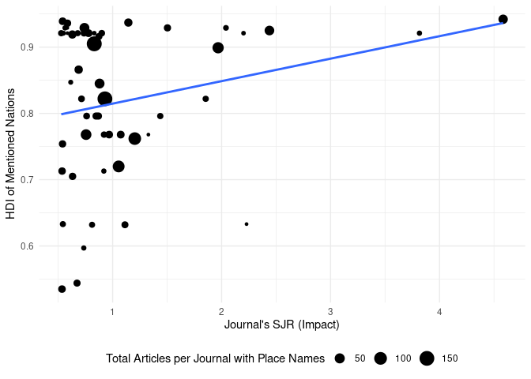

# Introduction

A good article title informs and can serve to attract readers.
Authors must write titles that succinctly capture the main topic of their paper.
Since titles function within the knowledge creation process,
titles reflect disciplinary identity and expectations [@milojevic_length_2017].
In some disciplines,
like math,
titles focus on succinctness.
Yet in other areas,
like the social sciences,
titles stress informativeness.
In the medical sciences,
the use of questions in titles has increased substantially since the 1960s,
showing also geographical trends,
representing perhaps institutional pressures to publish faster [@ball2009].

The need to market papers,
to express disciplinary identity,
to provide information,
and other factors leads to various naming conventions,
such as the use of colons in titles.
Titles with colons (compound titles) are less succinct and potentially more informative.
They move from making general statements (left of colon)
to specific statements (right of colon).
The specificity ranges from descriptive to declarative statements.
Succinct titles may focus on providing topical information.
Compound titles may add information about the method,
research design, results, or conclusion of a study [@li_evolution_2019].

Title informativeness can be helpful when searching literature for a topic.
The informativeness of a title can be a function of the words
it contains and its length or word count.
In the economics literature,
longer titles receive more citations ("the informative effect")
than succinct titles ("the succinct effect"),
but this is only true after the year 2000.
@guo_succinct_2018 attributes this to the rise of online searching,
where retrieval technology is based on relevance algorithms
that index keywords in various bibliographic fields.
@li_evolution_2019 found that title length started to increase during this time frame,
but defined title informativeness not solely based on word count
but on the proportion of content words
(e.g., nouns, verbs, adverbs) to function words
(e.g., pronouns, prepositions, conjunctions).
Titles with a higher ratio of content words are more informative.
This may be complicated though if function words are overly specific,
obscure, or non-normative in some way
[@fox_relationship_2015; @thelwall_avoiding_2017].

If a title poorly captures the information about the content of a paper,
then papers may be overlooked by searchers
even if the papers are relevant to them.
Alternatively, if title information is framed in such a way as to seem non-applicable,
even if the paper is relevant to a searcher,
then such papers may be overlooked.
For example, papers with titles that ask questions
have been shown to receive more downloads but fewer citations
than papers with other title types [@jamali_article_2011; @paiva_articles_2012].
This suggests that the information captured by
a question-type title is trendy, not informative, or
that the authors are less certain of the findings.
However, a disciplinary effect exists.
Papers with titles that ask questions are cited more
in the computer science literature [@fiala_are_2021]
but no citation effects were found for question-type
titles in an ecology journal [@fox_relationship_2015].

As mentioned, the use of compound titles
(titles with colons, hyphens, dashes) has grown in recent decades,
especially in some research areas or disciplines.
@li_evolution_2019 outlines three types of compound titles
that capture specific semantic content.
These are titles that describe the topic and the method or design,
titles that describe the topic and the results, and
titles that describe the topic and the conclusion of a study.
Additionally, some authors add geographical names to compound titles,
which may not add key semantic information about a paper's topic [@kou_politics_2018].
Studies have shown that papers with titles
that contain certain types of highly specific or obscure content,
like genus or species information [@fox_relationship_2015],
or specific geographical place names,
receive fewer citations
[@abramo_effect_2016; @costello_are_2019; @jacques_impact_2010;
@moradi_analysis_2016; @paiva_articles_2012; @thelwall_avoiding_2017].
The common explanation is that this kind of taxonomic or geographic specificity
is extraneous to the study, and
that it reduces the generality and
thus the appeal of the results reported in these papers to searchers or
potential audiences [@fox_relationship_2015; @thelwall_avoiding_2017].
However, pointing to more disciplinary differences,
specificity might be appreciated in some disciplines,
like entomology,
where titles with specific genus and species names or geographic names
have been shown to have greater impact [@murphy_does_2019].

@abramo_effect_2016 and others
[@fox_relationship_2015; @thelwall_avoiding_2017]
have reasoned that overly specific terms or words in titles,
especially those naming geographic entities,
tend to receive fewer citations because searchers reviewing these titles do not
find them relevant even if the topic is relevant.
@abramo_effect_2016 suggested,
for papers with geographical names in titles, that
"studies conducted at the country level would typically be less appealing
that [sic] those dealing with the same subjects at the broader level.
The researcher [or potential reader] could suspect that certain results
would be influenced by country-specific traits,
and therefore be difficult to generalize" (p. 13).
However, papers without specific geographical names in the titles
might still be limited to specific geographical areas,
and this raises questions not only about why some authors
include geographical information in titles
but also why some authors do not.

There is evidence that
the use of geographic names
in article titles
reveals potential biases
in the representation of Western and non-Western
populations in the CHI Conference Proceedings.
Specifically,
@kou_politics_2018 found that
"studies conducted with non-Western populations are significantly
more likely to highlight study contexts in titles and throughout the text,"
and that
"studies of Western countries are significantly more likely
to lack mention of the studied countries not only in titles,
but also throughout the text of the papers" [@kou_politics_2018, p. 2].
They also found that when country names were added to titles,
they were often added at the end of a title,
which suggested weak
"semantic connections between the preceding ideas in the titles and the countries" (p. 8).
Overall, their study suggests a geographical bias in the CHI literature
to normalize findings based on Western populations and
to exoticize findings based on non-Western populations.
These findings, however,
could be the result of researchers at or from
Western nations conducting research on
non-western populations, and
may say little about how researchers
use place names in titles when
studying populations within their own nations.

Like @kou_politics_2018,
we are interested in how authors use geographic names in titles.
However, @kou_politics_2018 apply a simple binary classification
of countries into Western and non-Western countries based on work by @huntington_clash_2011.
In accordance with @burns_language_2017,
we use the Human Development Index (HDI) [@united_nations_human_2023],
a compound index that measures a nation's level of
health, education, and standard of living,
in order to identify more nuanced patterns
in how countries are named in paper titles.
Based on this, we ask the following questions:

RQ1: Does the inclusion of geographical names in the titles
of journal articles impact their citation counts,
when controlling for the Human Development Index
score for the named location?

In order to answer these questions,
we propose the following hypotheses:

* Main Hypothesis: Journal articles with geographical names in their titles are
  cited less frequently than those without geographical names.
    * Sub-Hypothesis 1: The closer the geographical name is to the end of the title, the fewer the citations the article would receive.
    * Sub-Hypothesis 2: Articles mentioning nations with a higher Human Development Index in their titles are cited more frequently.
    * Sub-Hypothesis 3: The impact of geographical names in titles on citation counts is moderated by the impact of the journal.
    * Sub-Hypothesis 4: Journals with a high frequency of articles with geographical names in titles have a lower impact.
    * Sub-Hypothesis 5: Nations with lower HDIs will more likely appear toward the end of article titles than nations with higher HDIs.
    * Sub-Hypothesis 6: Journals may be more or less likely to publish articles that mention nations with higher or lower HDIs.

# Materials and Methods


Our data is focused on articles published in
library and information science (LIS) journals,
as broadly categorized and listed by
Scimago's Scientific Journal Ranking (SJR) and
the Scimago Journal and Country Rank (2021) data.
We limited our set of articles to the 61 journals
ranked in the first quartile of the LIS category.
We conducted Scopus queries for each journal in this list
and downloaded bibliographic records for articles published
in these journals from 2018 to 2020 (Fig. 1).
We retrieved 13145 article records across the 61 journals.
For example, our Scopus query for the journal
*International Journal of Information Management* was:

```
SRCTITLE ( "International Journal of Information Management" )  AND  (
LIMIT-TO ( PUBYEAR ,  2020 )  OR  LIMIT-TO ( PUBYEAR ,  2019 )  OR  LIMIT-TO
( PUBYEAR ,  2018 ) )  AND  ( LIMIT-TO ( DOCTYPE ,  "ar" ) )
```
<figcaption>Fig. 1: Example Scopus query to retrieve bibliographic records from one journal.</figcaption>

We combined and imported the bibliographic records into R
using the bibliometrix package [@aria_bibliometrix_2017].
We used the Python *spaCy*
natural language processing library
to identify country names from article titles
[@honnibal_spacy_2022].
We manually reviewed and revised the data after locating
false positives or negatives.
This resulted in  1493 (11.36%)
article titles with place names.
We added the 2021-2022 Human Development Index (HDI) from the
United Nations (UN) Development Programme that
matched the country in the titles.
The HDI summarizes three indices:
a life expectancy index, an education index, and
GINI index for measuring income inequality.


The Python *spaCy* library identified
country names from constituent locales,
such as specific states in the U.S.
Thus, if an article title mentioned a place like "Alaska",
then we used "United States"  for the nation and HDI variables.
Alternatively, if a title included a term like "american",
the *spacy* library was able to reference this as the *United States*.
Therefore, when titles included place name variations,
we referred to the canonical name for
the nation referenced or inferred in the title.

We were interested in the location of
the place name in each article title.
We wrote a Python script,
calling the *spaCy* natural processing library,
to detect the position of the nation names in article titles.
We manually reviewed all titles to address false positives and negatives.
The position of places in article titles was scored on a scale of 0 to 1.0,
with nations appearing as the last word in a title
receiving a score approaching 1.0.
Titles that did not contain a reference
to a geographical region scored a zero.
In cases where multiple countries were named in the title,
the score was based on the first instance.

Most places named in titles matched names in the HDI.
However, some articles had titles with nation names
that for political reasons do not have an HDI
(e.g., Taiwan and North Korea).
These were marked as NA in the HDI variable.
This reduced titles with nation names and HDI scores to
1484 records.
If a place was part of a broader collective
(e.g., Scotland or Puerto Rico),
we chose the HDI for the broader political authority
(i.e., the United Kingdom or the United States, respectively).
The HDI includes region level values:
when article titles referenced Africa,
we used the HDI for "Sub-Saharan Africa",
or when article titles referenced Europe,
we used the HDI for "Europe and Central Asia" (*n* = 154).
When multiple place names appeared in the title (*n* = 94),
we averaged the HDI scores.
The UN classifies HDI scores into four categories:
very high (\>= 0.8),
high (\>= 0.7),
medium (\>= 0.55),
and low (\<= 0.549).
The averaged HDI for titles that mention multiple locations
was very high on the HDI scale
(*m* = 0.858; *mdn* = 0.867),
indicating that nations with very high HDIs collaborate
with nations that also have very high HDIs.
However, the overall average HDI scores
indicate that most nations or places
named in article titles are nations or
places with very high HDI scores
(*m* = 0.814; *mdn* = 0.838).

Finally, we added SCImago Journal Rank (SJR) scores
for each of the 61 journal titles in the data set.
We use the SJR to control for citation effects across articles.
SJR scores ranged from
0.528 to 4.584
for the publication titles in the data.
A SJR score below 1.0 indicates below
average citations compared to all journals in *Scopus*.
The average SJR in the data was above average
(*m* = 1.333; *mdn* = 1.055).
However, after deduplicating publication titles and
counting only unique journal titles,
the average SJR in the data was lower
(*m* = 1.155; *mdn* = 0.848),
indicating publication titles with
higher SJR scores appear more freqently in the data.

# Results

This research aimed to investigate the relationship
between the presence of geographical names in journal articles
and their citation counts.
We tested several hypotheses to understand the nuances of this relationship.
Overall, we found that there was a small citation effect on journal articles
that contained place names in titles.
Articles that contained place names received significantly but slightly fewer
citations, on average, than articles without place names.
However, we were unable to associate this effect in any
of our additional hypotheses.


## Hypotheses


**Main hypothesis:** We hypothesized
that journal articles
with geographical names in their titles
(*n* = 1484)
are cited less frequently
than those without geographical names
(*n* = 11652).
The Mann-Whitney U test revealed a statistically significant difference
in citation distributions between articles with and without
geographical names in their titles
(*p* < 0).
Further analysis showed that articles with geographical names
had a lower average citation count
(*mdn* = 6) than
those without geographical names
(*mdn* = 7).


**Sub-Hypothesis 1:** We hypothesized that
the nearer a place name is
to the end of the title,
the fewer the citations the article would receive.
We found some evidence in the data
for the opposite.
Specifically, we found a statistically significant,
positive correlation,
(*rho* = 0.094;
*p* < 0),
indicating that the closer a place name was to the end
of a title,
the more citations it received.
However, the correlation
although significant was weak (Fig. 2).


**Sub-Hypothesis 2**: We found no evidence to support
our hypothesis that articles mentioning nations with a higher
Human Development Index in their titles
were cited more frequently.
The correlation between the HDI of a nation
named or inferred in a title was neither significant nor strong
(*rho* = 0.004;
*p* = 0.868).


**Sub-Hypothesis 3**: We hypothesized that the impact of geographical names
in titles on citation counts
would be moderated by the impact of the journal.
We found that the impact of the journal
does not appear to play a moderating role in the relationship
between geographical names in article titles and citation counts,
based on the data.
Specifically, our data shows that any relationship is likely due to
random chance
(*p* = 0.392).


**Sub-Hypothesis 4:** We hypothesized that
journals that publish a high frequency of articles
with geographical names in titles
are journals that have lower impact scores.
However, our data indicated a weak, negative correlation
between the frequency with which a journal publishes
articles with place names in titles and
the journal's impact score
(*rho* = -0.19;
*p* = 0.143) (Fig. 3).


**Sub-Hypothesis 5:** We hypothesized that there would be a
relationship between the position of a place name in the title
and the HDI of the nation named:
specifically, that nations with lower HDIs will more
likely appear toward the end of article titles.
We found that nations appear more often
in different positions in the article titles,
but we could not find a cause of this relationship
from our data (Fig. 4).
Specifically, we found a weak, negative correlation
between the average position of a named place
in a title
and the HDI of the named place
(*rho* = -0.146;
*p* = 0.476).
Although our data suggests that different nations
appear in different average positions in titles,
this does not appear to be due to the nation's HDI score.


**Sub-Hypothesis 6:** We hypothesized that
journals may be more or
less likely to publish articles that
mention nations with higher or lower HDIs.
We found no evidence to suggest
to suggest a relationship between
the frequency journal titles include articles
that mention place names and
the HDIs of the named nations
(*rho* = 0.119;
*p* = 0.387) (Fig. 5).



# Discussion

Based the results of other studies
that have found that titles that were overly specific
about certain factors were cited less
[@fox_relationship_2015; @thelwall_avoiding_2017],
we developed a hypothesis that journal articles with
geographical names in their titles
would be cited less frequently
than those without geographical names
[@abramo_effect_2016; @costello_are_2019; @jacques_impact_2010;
@moradi_analysis_2016; @paiva_articles_2012; @thelwall_avoiding_2017].
Like @kou_politics_2018,
we found evidence to support this hypothesis;
however, although the difference was statistically significant,
the effect size was minimal.
Additionally, all sub-hypotheses mostly yielded non-significant results
or showed weak relationships.
These results indicated that
the reasons behind this phenomenon are complex,
poorly explained by variables examined in this study,
or simply that the evidence that supports our main
hypothesis is too weak because there is no relationship.

Further research might explore other potential factors
that influence citations to articles with place names.
These factors may include the specific content of the articles,
the information presented in the abstracts,
the disciplines of the journals,
broader cultural or academic trends, or
the language or coauthorship characteristics.
Also, the small citation difference
observed in the main hypothesis
may be the result 
that papers with place names
in their titles are read and cited heavily
by local author networks
[@Chinchilla-Rodríguez2014What].
If further studies examine the citation networks
of articles that include place names,
we hypothesize that there is a substantial
within-nation network citation advantage to including
place names in articles,
especially if geographical context
plays an important role in a study
[@murphy_does_2019].
For example, articles that include the geographical name
"Bangladesh" or "United Kingdom" might tend to attract
citations from others in Bangladesh or the United Kingdom, respectively.
Such localized citations could be a reflection of the article's relevance
to that particular context.
Additionally, while including a geographical name might lead
to a perceived loss of generality,
making the article seemingly less applicable to a broader audience,
this disadvantage might be offset
by the strength of one's academic, professional, or geographical network.
Researchers from the local networks might find the article
more directly relevant to their work and more likely to cite it.

Although papers that reference country names
in titles received fewer citations and
journals that frequently include articles
that refer to named countries had lower SJR scores,
we could find no relationship between the development level
of a named country with the number of citations.
We could also find no relationship
between the location of the country name in the title
with the article's citations.
Overall, although articles that reference country names
in their titles receive fewer citations and journals have lower SJR scores,
there does not seem to be a geographical bias against specific countries.
We believe that the citation disadvantage associated
with lower citation counts to articles that reference named countries
is primarily a result of perhaps unnecessary specificity
that naming countries adds to the titles and
that makes the articles seem less relevant to others.
While the country name in an article's title refers to less citation and
placed in the lower ranked journals,
we recommend not to use country name in the title.
Even having a country name in the title may lead to bias among the researchers.

## Limitations

It could be that the effects are more pronounced
when sampling from lower impact journals
in some other disciplines.
Here, we only considered LIS journals.
A future study with journals from other disciplines can add evidence
to support the present result that we got from this study.
The results could be different with a longer citation window.
We also did not control for other factors,
such if a title contains a colon, a question, humor.

# References
